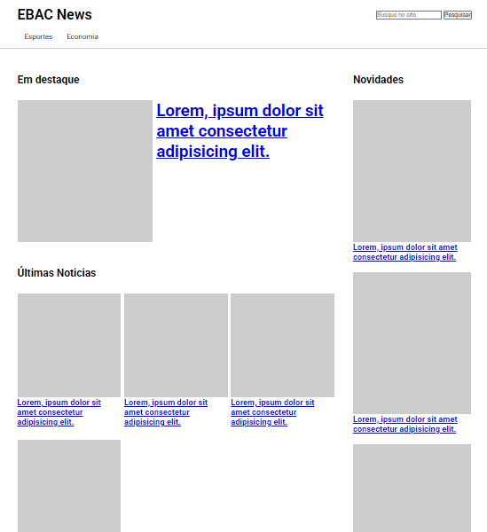

### Sobre CSS Responsivo

Aprendi muito neste modulo e entendi a importancia de responsividade que é de grande importância visto que nos dias atuais os maior acesso vem de dispositivos moveis.

Clique para ver 👇

    <a href="">
        </img>
    </a>

